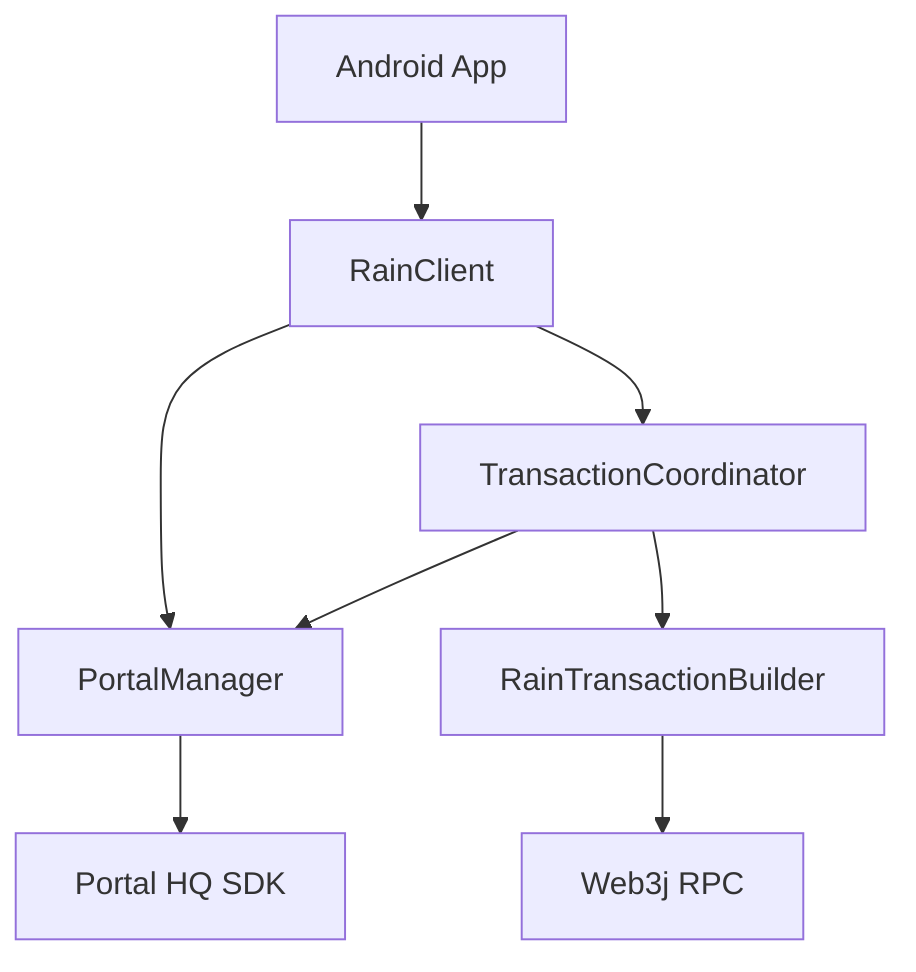

# Rain SDK Core

The Rain SDK is a comprehensive Android library designed to simplify blockchain interactions and provide built-in MPC wallet capabilities for seamless crypto and card service integration.

## Table of Contents

- [Architecture](#architecture)
- [Key Features](#key-features)
- [Core Components](#core-components)
- [Data Models](#data-models)
- [Error Handling](#error-handling)
- [Advanced Configuration](#advanced-configuration)

---

## Architecture

Rain SDK sits between your application logic and the blockchain. It encapsulates:

1. **Portal SDK**: For MPC wallet management (Key generation, signing).
2. **Web3j**: For interacting with Ethereum-compatible blockchains.
3. **Internal Orchestration**: Managing the complex flow of multi-step transactions.



## Key Features

- **Dual Mode Operation**:
  - **Full Mode**: Uses the integrated Portal MPC wallet.
  - **Utility Mode**: Use the internal builders to generate data for your own wallet implementation.
- **Unified Withdrawal Flow**: A single method call handles validation, EIP-712 signing, and transaction submission.
- **Token Operations**: Built-in support for sending native and ERC-20 tokens.
- **Balances & History**: Seamlessly retrieve wallet balances and full transaction history.
- **Smart Utilities**: Integrated QR code generation and gas estimation for better UX.
- **Thread Safety**: Built using Kotlin Coroutines for efficient, non-blocking operations.

## Core Components

### `RainClient`

The primary entry point. Accessed via `RainSdk.getInstance().client`.

- `initializeTurnkey(...)`: Registers the baseline Turnkey wallet provider.
- `initialize(...)`: Wallet-agnostic init; pair with `register(...)` / `setWalletProvider(...)`.
- `register(provider)` / `provider(id)` / `providers(matching)`: provider registry.
- Portal setup lives in `:rain-portal` (`com.rain.sdk.portal.initializePortal`).
- `getWalletAddress()`: Retrieves the hex-encoded wallet address.
- `getNativeBalance(chainId)`: Gets the native token balance.
- `getERC20Balance(chainId, tokenAddress, decimals)`: Gets specific ERC-20 balance.
- `getERC20Balances(chainId)`: Gets all ERC-20 balances for the wallet.
- `sendNativeToken(...)`: Transfers native cryptocurrency.
- `sendToken(...)`: Transfers ERC-20 tokens.
- `getTransactions(...)`: Fetches transaction history for a specific chain.
- `withdrawCollateral(...)`: Orchestrates the full withdrawal flow.
- `estimateGas(...)`: Estimates gas fees for any transaction data.
- `generateAddressQRCode(...)`: Generates a Bitmap QR code for a wallet address.

### `RainTransactionBuilder`

Low-level utilities for manual transaction construction.

- `buildEIP712Message(...)`: Generates typed data for user signing.
- `buildWithdrawTransactionData(...)`: Encodes the final contract call.

## Data Models

### `RainWithdrawAddresses`

Groups all contract and token addresses required for a withdrawal.

```kotlin
data class RainWithdrawAddresses(
    val proxyAddress: String,      // Collateral Proxy
    val controllerAddress: String, // Collateral Controller
    val tokenAddress: String,      // Token to withdraw
    val recipientAddress: String   // Target wallet
)
```

### `RainAdminSignature`

Contains the authorization data provided by your backend.

```kotlin
data class RainAdminSignature(
    val salt: String,
    val signature: String,
    val expiresAt: String // ISO-8601 format
)
```

### `RainTransaction`

Represents a single blockchain transaction.

```kotlin
data class RainTransaction(
    val hash: String,
    val blockNumber: String?,
    val blockTimestamp: String?,
    val from: String,
    val to: String?,
    val value: String?,
    val chainId: String?
)
```

### `RainTokenTransferResult`

Result of a token transfer operation.

```kotlin
data class RainTokenTransferResult(
    val transactionHash: String
)
```

## Error Handling

All SDK operations throw `RainError`. Use a `try-catch` block to handle them:

- `RainError.NetworkError`: Problem communicating with RPC nodes.
- `RainError.ProviderError`: Error from the Portal MPC provider.
- `RainError.InvalidConfig`: Missing or incorrect parameters/setup.
- `RainError.InternalError`: Unexpected SDK behavior.

## Advanced Configuration

You can configure RPC endpoints and security settings via `RainConfig`:

```kotlin
RainConfig.getInstance().setRpcUrl(chainId, "https://...")
```
